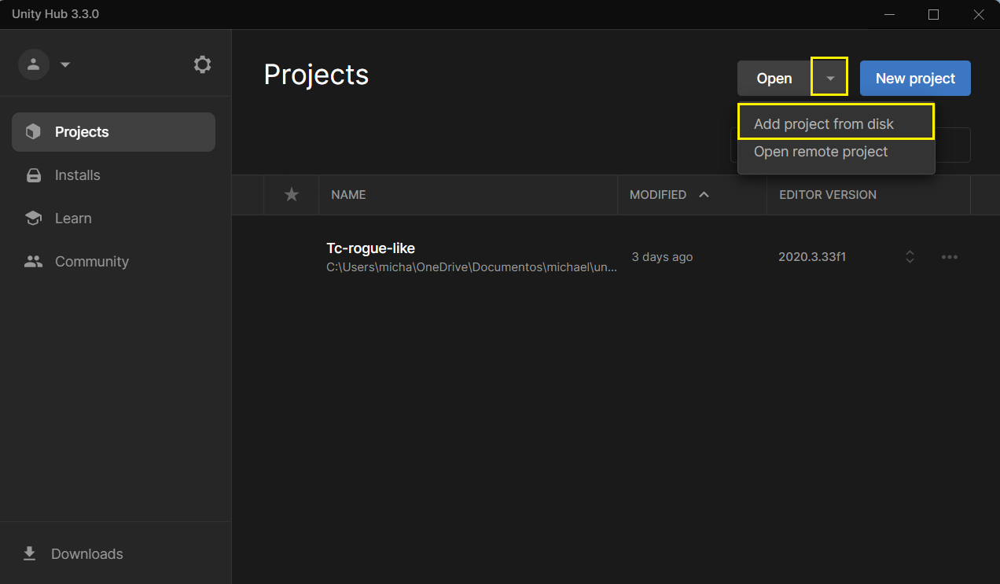
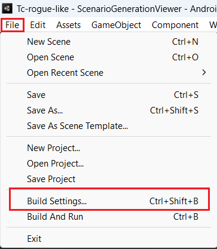
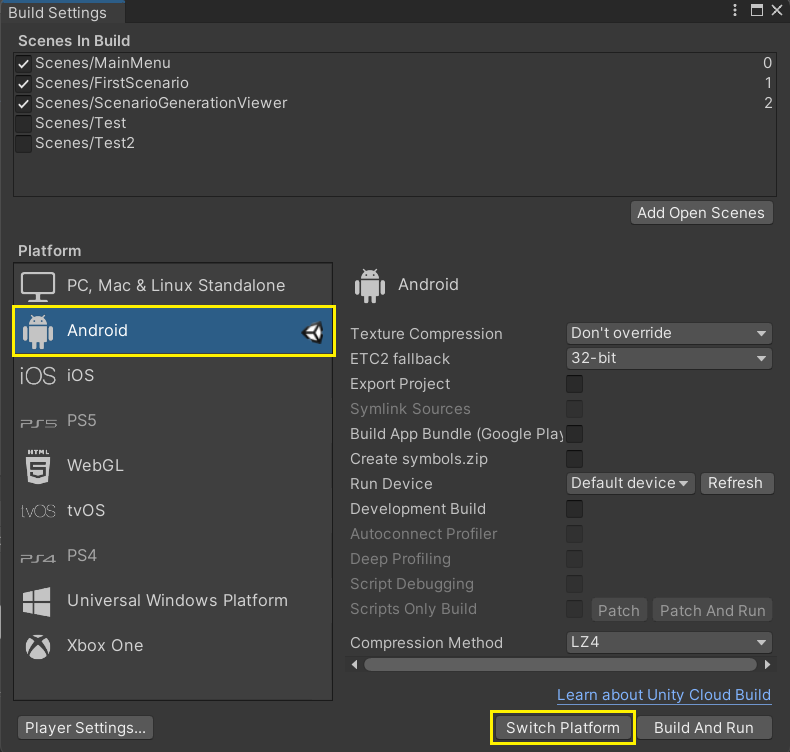
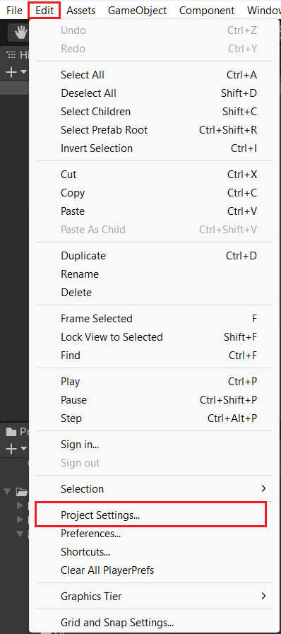
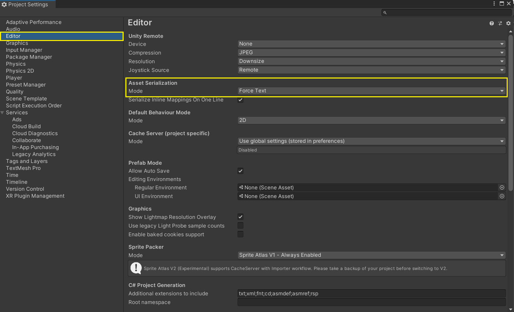
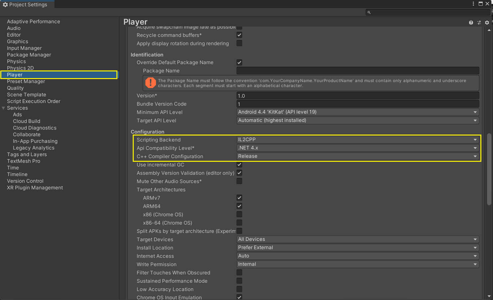

<h1>Configurando o projeto</h1>

***

Esse arquivo irá apresentar as configurações e etapas necessárias para a utilização projeto. Algumas 
ferramentas são necessárias para modificar o projeto, são elas: 

 - O Git para a clonagem e versionamento das alterações do projeto; 
 - É recomendada a utilização do Unity em alguma versão equivalente à 2020.3.x, qualquer outra versão 
 não garante que todos o componentes do jogo irão funcionar como esperado; 
 - Com a versão correta instalada, deve-se ter também todos os módulos do Android instalados, sendo esses: 
   - Android Build Support; 
   - Android SKD & NDK Tools; 
   - Open JDK.
 - Alguma IDE ou Editor de código, é recomendado o Visual Studio ou o Visual Studio Code pelo fato do 
 código ser escrito com a linguagem de programação C#. 

Uma vez os arquivos do projeto já foram clonados para a máquina local, deve-se importar no Unity, então 
dentro do Unity Hub clique nos botões destacados na imagem abaixo. 
  

    

 
Agora deve-se escolher o caminho do projeto que foi clonado, seguir na escolha da plataforma e esperar 
o projeto compilar arquivos, baixar as dependências necessárias e então chegar no local de trabalho de 
fato. 

Pós todas as etapas serem finalizadas, é necessário realizar algumas configurações e confirmar que outras 
estão definidas corretamente, dito isso, clique em File na parte superior esquerda do programa. 
  

    

 
Em seguida clique em build settings pois é preciso alterar a plataforma alvo para o Android por se tratar 
de um jogo de dispositivos móveis. A imagem a seguir demonstra esse caminho.
  

    

 
Após toda a compilação dos arquivos ser efetuada, deve ser acessado o menu de configurações do projeto para 
verificar se a versão e estilo de compilação estão corretos para o jogo, além da maneira que o Unity lidará 
com todos os itens criados no projeto.
  

    

 
Acessando essa aba, siga para os itens demonstrados na imagem e verifique se as seguintes configurações estão de acordo com o projeto da sua máquina local, caso não, deixe-os da maneira apresentada nas imagens. 
  

    

  

    

 
Ao final de todo esse processo de configurações e validações é possível seguir com a utilização do projeto da maneira que melhor se adequa para as alterações desejadas.
  

[Voltar para o Readme principal](../../README.md)
